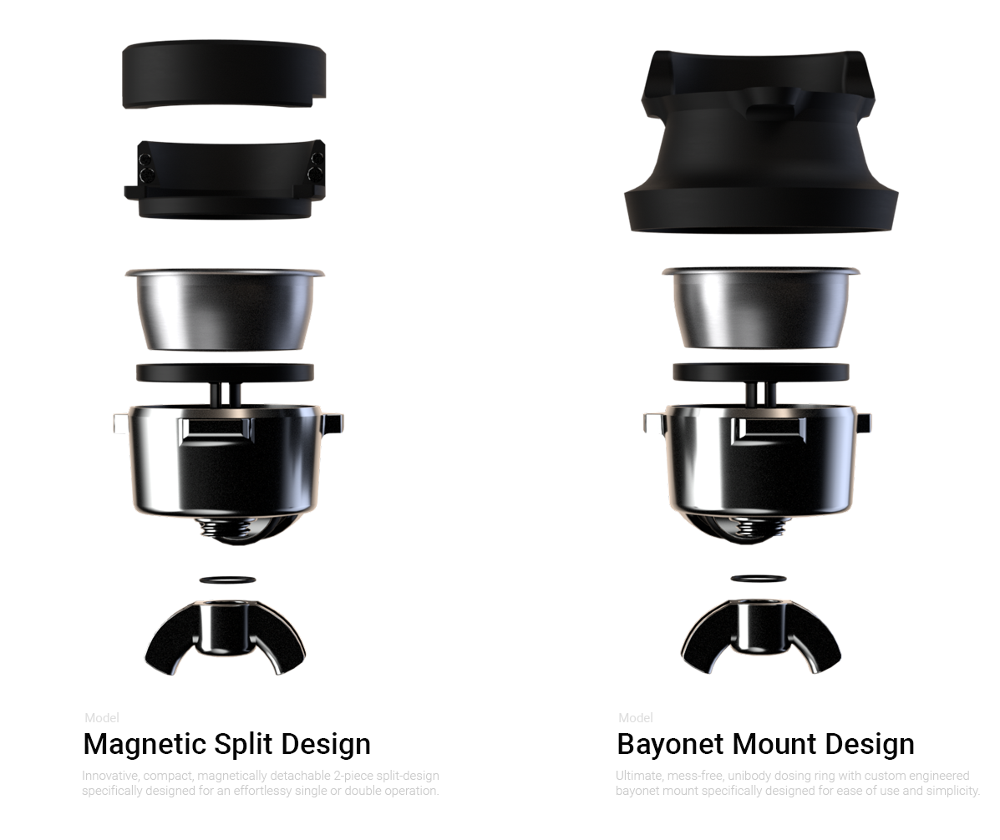
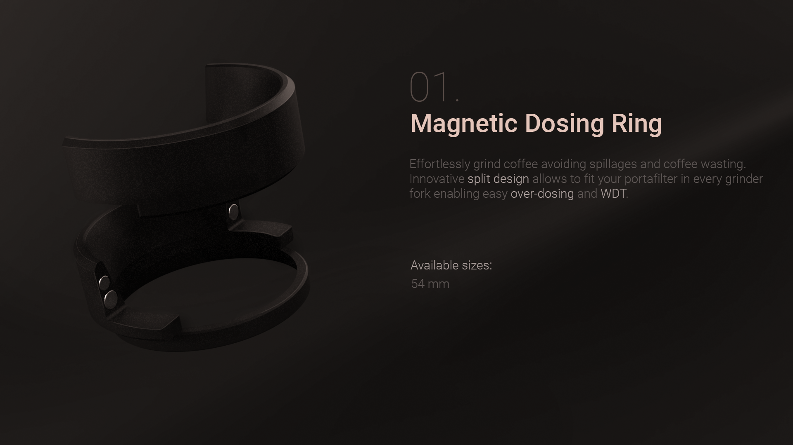
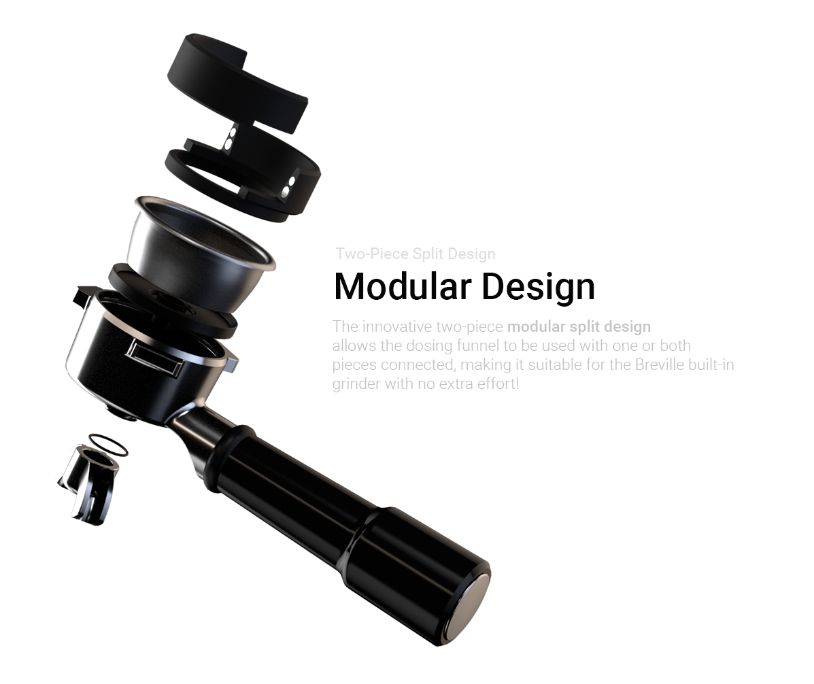
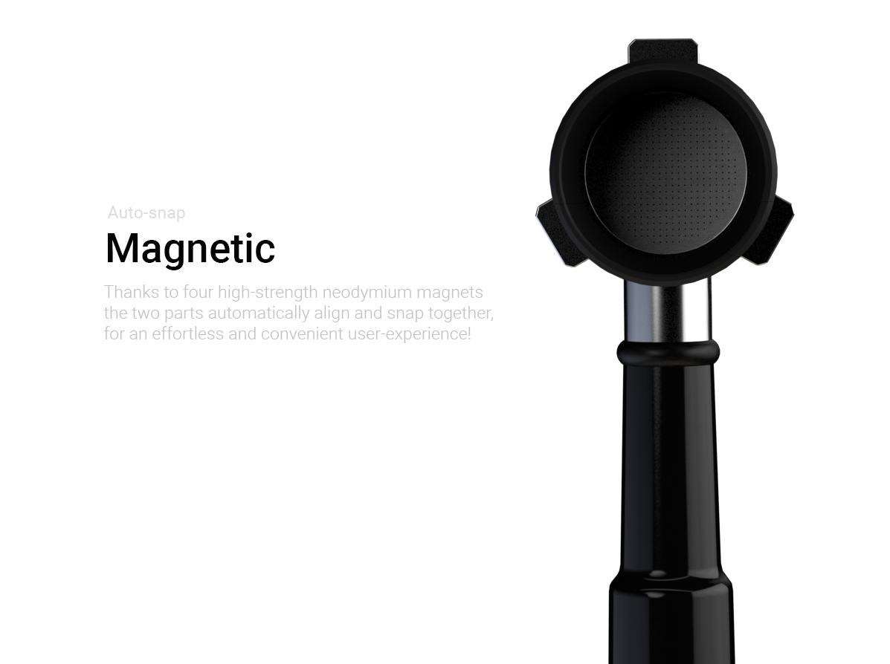
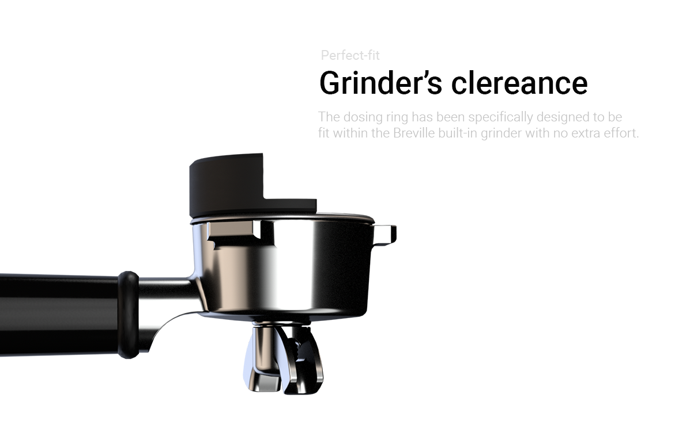
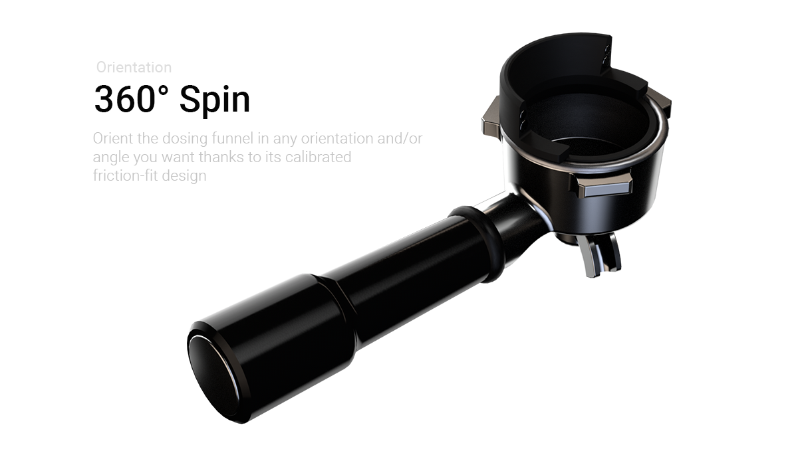
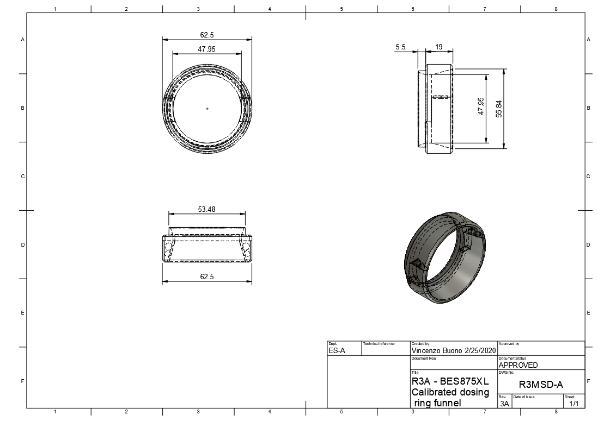
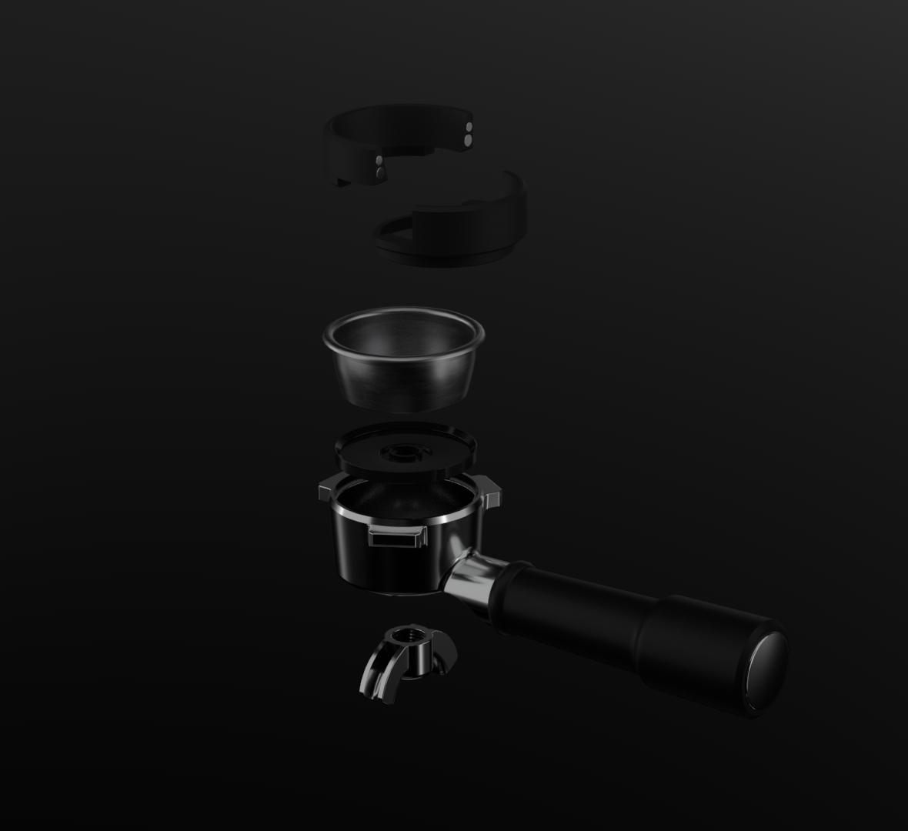
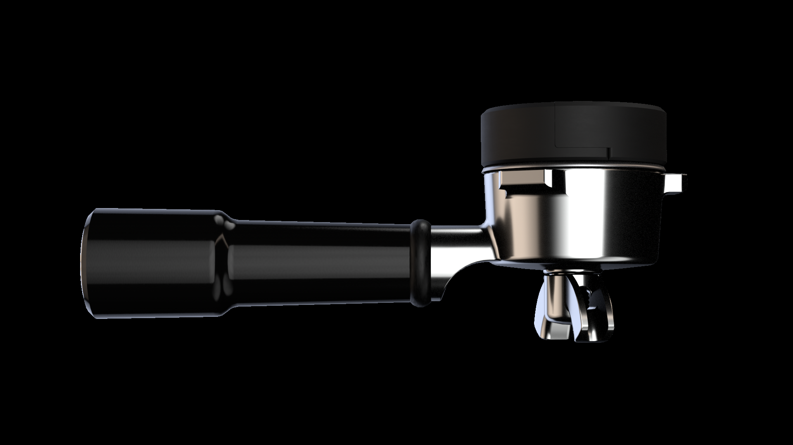

# BES875XL | Breville/Sage Dosing Funnel <!-- omit in toc -->
> Effortlessy grind coffee avoiding spillages and coffee wasting through innovative designed custom engineered dosing rings

    

## Table of contents <!-- omit in toc -->
- [Introduction](#introduction)
- [Compatibility](#compatibility)
- [Models](#models)
  - [Magnetic Split Design](#magnetic-split-design)
    - [Modular design](#modular-design)
    - [Magnetic](#magnetic)
    - [Grinder's clereance](#grinders-clereance)
    - [360° Spin](#360%c2%b0-spin)
    - [Drawings](#drawings)
    - [Additional pictures](#additional-pictures)
    - [Bayonet Mount Design](#bayonet-mount-design)

## Introduction

Grinding coffee directly into the portafilter can be messy and wasteful  as the grounded coffee often tends to spill over. For a mess-free shot prep a dosing funnel becomes required. In the following paper two design variant, specifially designed for the the Breville/Sage, depending on you residence country, 875XL or any other compatible variant that utilize the _portafilter Model: __SP0001515___, have been illustrated. For a complete list of compatible appliances please take a look at the [compatibility](#compatibility) section.

## Compatibility

The proposed dosing funnel design solutions have been specifically designed and engineered for the BES875XL but are compatible with any Breville/Sage appliances that utilized the _portafilter Model: __SP0001515___.

Compatible models:
* BES870XL
* BES800XL
* Infuser
* BES840XL
* Duo-Temp BES810BSS

> For a more detailed and up to date list of compatible portafilter and appliances, please refer's to the [manufacturer's website](https://www.breville.com/us/en/parts-accessories/parts/sp0001515.html)

Despite it's large compatibility, has to be kept in mind that the attached designs have been engineered with specific mechanical constraints defined mostly by the [Locator For Porta Filter Model: SP0001558]((https://www.ereplacementparts.com/locator-for-porta-filter-p-1810332.html?osCsid=m8t7f3h5rjta44luisd92trhb4))

## Models

### Magnetic Split Design
> Innovative, compact, two-piece split design

    

_Two-piece split design_ dosing funnel characterized by a __compact__ design, __beautiful chamfer edges__, __two mode operations__, __inner rim seating__ and __magnetic automatic snap__. The funnel thanks to its innovatible split design, can be operated as a _standalone dosing funnel_, with both pieces attached, or with _just one_ allowing to use the built-in breville grinder without crashing with the grinder fork for a mess-free shot prep. The two mating parts automatically snaps together thanks to their four neodymium high-stregth magnets.

#### Modular design

    

#### Magnetic

    

#### Grinder's clereance

    

#### 360° Spin

    

#### Drawings

    

Drawings available for download as:
* __.PDF__: [here](./bes875xl-r3smd-a/bes875xl-r3smd-a-drawing.pdf)
* __.PNG__: [here](./bes875xl-r3smd-a/bes875xl-r3smd-a-drawing.PNG)

#### Additional pictures

    

    

#### Bayonet Mount Design

> Work in progress - soon to be updated